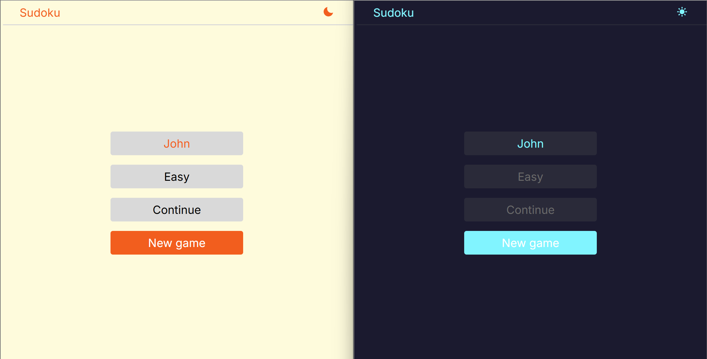
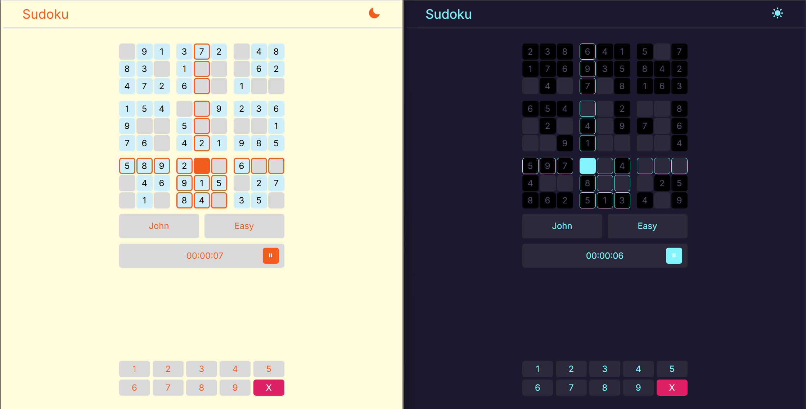

# 🧩 Sudoku Game

A simple and responsive Sudoku game built using pure **HTML**, **CSS**, and **JavaScript**. No backend, no frameworks — just vanilla web technologies!

## 📸 Screenshot




## ✨ Features

- 9x9 interactive Sudoku grid
- Selectable difficulty levels (Easy, Medium, Hard)
- Timer to track progress
- Player name display
- Input highlighting and error indicators
- Responsive layout with dark mode support

## 🚀 Getting Started

### 1. Clone the Repository

```bash
git clone https://github.com/your-username/sudoku-game.git
cd sudoku-game
